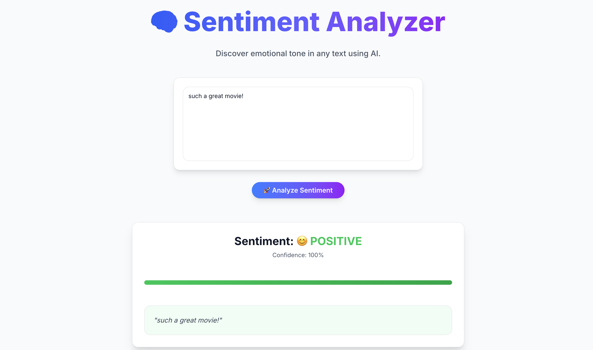

# 🎬 SentimentScope — Browser-Native Sentiment Analysis

> Analyze movie review sentiment instantly — 100% client-side with TensorFlow.js + Next.js. No server. No API. Just AI in the browser.



---

## 🌟 What It Does

Type or paste a movie review — the app will predict whether it’s **positive** 😊 or **negative** 😞 using a pre-trained **BiLSTM model** (originally trained on the IMDB dataset) — all running **directly in your browser** via TensorFlow.js.

🔒 **Privacy-first**: Your text never leaves your device.  
⚡ **Fast & offline-capable**: Once loaded, works without internet.  
🎓 **Educational**: Great for learning how to deploy Keras models to the web.

---

## 🛠️ How It Works

1. **Text Input**: You type a review.
2. **Tokenization**: Words are mapped to indices using `vocab.json`.
3. **Padding/Truncating**: Sequences are fixed to `MAX_LEN=200`.
4. **Model Inference**: The TensorFlow.js model (`model.json` + shards) runs prediction.
5. **Result Display**: Probability score + sentiment label shown instantly.

> 🧠 Model: Bidirectional LSTM trained on IMDB, exported from Keras → TF.js  
> 📦 Vocabulary: Top 20,000 words, index offset +3 (start=1, OOV=2, pad=0)

---

## 🚀 Getting Started

### Prerequisites
- Node.js ≥ 16
- npm or yarn

### Install & Run

```bash
git clone https://github.com/yarjanlou/sentiment-analysis.git
cd sentiment-analysis/sentiment-analyzer
npm install
npm run dev